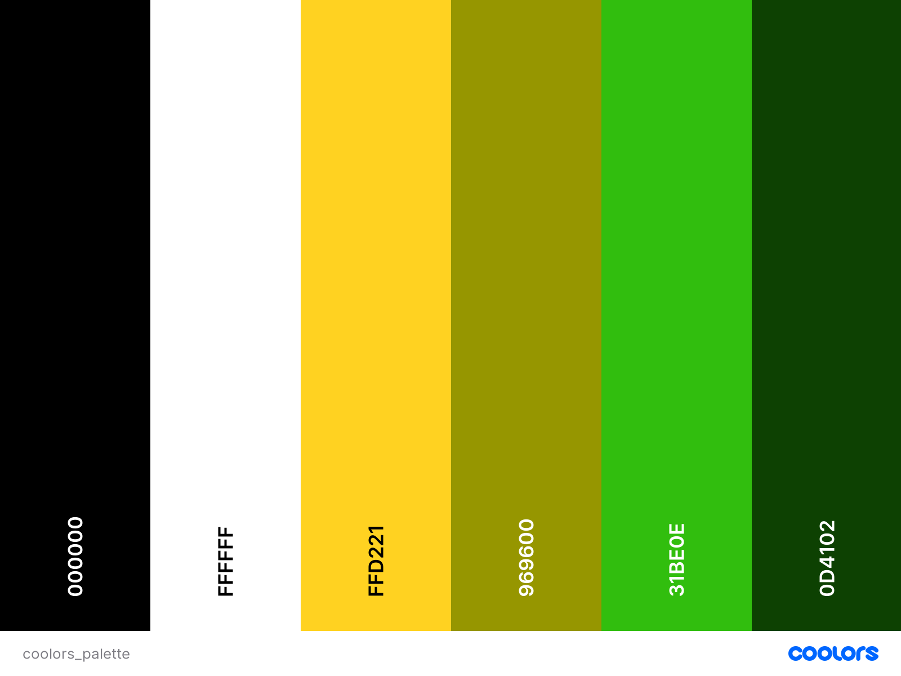

**Marvel Fanpage Project**
======

## **Loki Variants | Marvels Multiverse**
By: [Puk](mailto:puksbusinessworld@gmail.com), November 2021 

***Screenshot created using [Am I responsive](http://ami.responsivedesign.is/).***

### [View the live project here](https://puksrevolution.github.io/loki_variants)

---
### **Table of Contents** ###

- [Project](#project)
  - [Project Description](#project-description)  
  - [Project Goals](#project-goals)
  - [Website Description](#website-description)  
- [Design](#design)
  - [Colours](#colours)
  - [Typography](#typography)  
- [Technologies](#technologies)
  - [Languages](#languages)
  - [Tools](#tools)
- [Features](#features)    
  - [Additional Site Features](#additional-site-features)
  - [Future Features](#future-features)
- [Testing](#testing)
- [Bugs](#bugs)
- [Deployment](#deployment)  
- [Credits](#credits)
  - [Images](#images)
  - [Code](#code)
- [Acknowledgements](#acknowledgements)
---

**Project**
======

### **Project Description** ###

### **Project Goals** ###

### **Website Description** ###

[Back to Table of contents](#table-of-contents)

---

**Design**
===

### **Colours** ###

***The colour schemes is created by using [Coolors](https://coolors.co/).***

- *text/textshadow/background* (#000000) - Black
- *text/textshadow* (#FFFFFF) - White
- *text* (#FFD221) - Cyber Yellow
- *intro text animation* (#969600) - Citron
- *text hover effect* (#31BE0E) - Kelly Green
- *background* (#0D4102) - Forest Green Traditional

### **Typography** ###

- *Body:* [Nunito, sans-serif](https://fonts.google.com/specimen/Nunito?query=Nunito)
- *Heading:* [Mirza, cursive](https://fonts.google.com/specimen/Mirza?query=Mirza)
- *Intro animation:* [Cinzel Decorative, cursive](https://fonts.google.com/specimen/Cinzel+Decorative?query=Cinzel+Decorative)

***Fonts used from [Google fonts](https://fonts.google.com/)***

[Back to Table of contents](#table-of-contents)

---

**Technologies**
===

### **Languages** ###

- [HTML5](https://developer.mozilla.org/en-US/docs/Web/HTML)
- [CSS3](https://developer.mozilla.org/en-US/docs/Web/CSS)
- [JavaScript](https://developer.mozilla.org/en-US/docs/Web/JavaScript)
- [jQuery](https://jquery.com/)

### **Tools** ###

- [Git](https://git-scm.com/)  
- [GitHub](https://github.com/)  
- [GitPod](https://www.gitpod.io/)
- [GitHub Pages](https://github.com/)
- [Font-Awesome](https://fontawesome.com/icons?d=gallery)  
- [Google fonts](https://fonts.google.com/)
- [Coolors](https://coolors.co/)  
- [paint.net](https://www.getpaint.net/roadmap.html)  
- [favicon.io](https://favicon.io/)  
- [Am I Responsive?](http://ami.responsivedesign.is/)
  
[Back to contents](#contents)

---

**Features**
===

### **Additional Site Features** ###

- A set of friendly HTTP Error landing pages for site visitors to see if a requested page is unavailable or cannot be accessed.

### **Future Features** ###

[Back to Table of contents](#table-of-contents)

---

**Testing**
===

- Testing information can be found in a separate [TESTING.md](Documentation/TESTING.md) file.

[Back to Table of contents](#table-of-contents)

---
**Bugs**
===

- Bug informations can be found in a separate [TESTING.md](Documentation/TESTING.md) file.

[Back to Table of contents](#table-of-contents)

---

**Deployment**
===

The website was developed using Gitpod and using Git pushed to GitHub, which hosts the repository.

[Back to Table of contents](#table-of-contents)

---

**Credits**
===

### **Images** ###

**Favicon**
- [Loki Helmet](https://www.iconfinder.com/icons/281787/god_loki_hero_super_icon) - icon by [Francesco Paradiso](https://www.iconfinder.com/Franky_) - source from [IconFinder](https://www.iconfinder.com/)

**Loki Logo**
- [Marvel Studios series Loki Logo](https://www.marvel.com/articles/tv-shows/sdcc-2019-marvel-studios-loki-on-disney-details-revealed) - copyright by [Marvel Studios](https://www.marvel.com/movies)

**Menu Icon**
- [Loki Helmet](https://www.iconfinder.com/icons/281787/god_loki_hero_super_icon) - icon by [Francesco Paradiso](https://www.iconfinder.com/Franky_) - source from [IconFinder](https://www.iconfinder.com/)

**Intro Page**
- [Alligator Loki](https://comicvine.gamespot.com/images/1300-8066698) - copyright by [Marvel Studios](https://www.marvel.com/movies)
- [Classic, Kid and Alligator Loki](https://newsconcerns.com/loki-concept-art-features-designs-for-classic-loki-kid-loki-and-alligator-loki/) - copyright by [Marvel Studios](https://www.marvel.com/movies)
- [Richard E Grant as Classic Loki in 'Loki' (Disney+)](https://meaww.com/loki-episode-5-richard-e-grant-classic-loki-disney-plus-marvel-fan-reactions) - copyright by [Marvel Studios](https://www.marvel.com/movies)
- [Thor Ragnarok Posters](https://marvelcinematicuniverse.fandom.com/wiki/Loki?file=Thor_Ragnarok_Textless_Character_Posters_03.jpg) - copyright by [Marvel Studios](https://www.marvel.com/movies)
- [Classic Loki Artwork](https://www.artstation.com/artwork/nYzxZ4) - Artwork by [Mizuri](https://www.artstation.com/mizuri)
- [Classic Loki](https://mobile.twitter.com/MikeJMika/status/1412790199352926208/photo/1) - copyright by [Marvel Studios](https://www.marvel.com/movies)
- [Loki Poster](https://www.marvel.com/articles/tv-shows/loki-variants-character-posters) - copyright by [Marvel Studios](https://www.marvel.com/movies)
- [Classic Loki Poster](https://www.marvel.com/articles/tv-shows/loki-variants-character-posters) - copyright by [Marvel Studios](https://www.marvel.com/movies)
- [Kid Loki Poster](https://www.marvel.com/articles/tv-shows/loki-variants-character-posters) - copyright by [Marvel Studios](https://www.marvel.com/movies)
- [Alligator Loki Poster](https://www.marvel.com/articles/tv-shows/loki-variants-character-posters) - copyright by [Marvel Studios](https://www.marvel.com/movies)
- [Alligator Loki](https://discussingfilm.net/2021/07/07/loki-episode-5-review-a-near-perfect-penultimate-episode/) - copyright by [Marvel Studios](https://www.marvel.com/movies)
- [Loki sees Pres Loki](https://marvelcinematicuniverse.fandom.com/wiki/Loki_Palace/Gallery?file=Loki_sees_pres_loki.jpg) - copyright by [Marvel Studios](https://www.marvel.com/movies)
- [Loki & TVA](https://marvelcinematicuniverse.fandom.com/wiki/Loki/Time-Traveller?file=Loki_%2526amp%253B_Small_Man.jpeg) - copyright by [Marvel Studios](https://www.marvel.com/movies)
- [Loki & TVA at table](https://marvelcinematicuniverse.fandom.com/wiki/Loki/Time-Traveller?file=%2526quot%253BYou%2527re_all_variants%2521%2526quot%253B.png) - copyright by [Marvel Studios](https://www.marvel.com/movies)
- [Loki & flame dagger](https://marvelcinematicuniverse.fandom.com/wiki/Loki/Time-Traveller?file=Come_and_get_me%2521_2.png) - copyright by [Marvel Studios](https://www.marvel.com/movies)

**History Page**
- [Thor Ragnarok Posters](https://marvelcinematicuniverse.fandom.com/wiki/Loki?file=Thor_Ragnarok_Textless_Character_Posters_03.jpg) - copyright by [Marvel Studios](https://www.marvel.com/movies)
- [Loki, God of Mischief](https://muc.fandom.com/wiki/Loki) - Artwork by [Unknown]() - source from [Fandom Wiki](https://www.fandom.com/)

**Gallery Page**
- [Classic, Kid and Alligator Loki Artwork](https://www.reddit.com/r/marvelstudios/comments/opy24e/loki_concept_art_featuring_classic_loki_kid_loki/) - Artwork by [Wesley Burt](https://www.instagram.com/wes_burt/?hl=en) - shared by [Marvel Studios](https://www.marvel.com/movies)
- [Loki Fan Art](https://www.pinterest.com/pin/838654761830266501/) - Artwork by [Artmetica](https://twitter.com/artmetica) - source from [Pinterest](https://www.pinterest.com/)

### **Code** ###

**Responsive Navbar**
- [Responsive Navbar Using CSS Grid/Flexbox](https://codepen.io/bowersrd/pen/dwXLba) - code snippet by [Reggie Bowers](https://codepen.io/bowersrd) - source from [CodePen](https:/https://codepen.io/)

**Intro Page**
- [Marvel Logo animation | pure CSS](https://codepen.io/jessynd/pen/aObLYJ) - code snippet by [jessica duarte](https://codepen.io/jessynd) - source from [CodePen](https:/https://codepen.io/)

[Back to Table of contents](#table-of-contents)

---

**Acknowledgements**
===

- [CodePen](https:/https://codepen.io/) for code snippets from severale members

[Back to Table of contents](#table-of-contents)